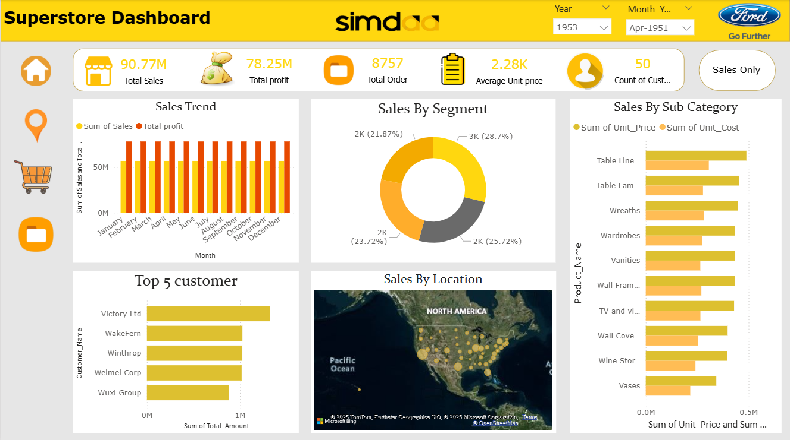

# 📊 Ford Motor Company - Superstore Sales Analysis Dashboard

This project presents a detailed **Power BI dashboard analysis** for **Ford Motor Company's Superstore Sales** data.
It helps uncover valuable business insights across different regions, products, customer segments, and time periods.

---

## 📌 Key Insights

- 🏬  **Total Profit:** ₹78.25M | **Orders:** 8,757  
- 🔍 **Top Performing States**: California, Texas, Illinois  
- 🧑‍💼 **Top 5 Customers:** Victory Ltd, WakeFern, Winthrop, Weimei Corp, Wuxi Group  
- 🗺️ **Sales By Location**: Clear geographic analysis through map visuals  
- 🏷️ **Category Insights**: Table products, Wreaths, Wardrobes lead in revenue  

---

## 📈 Dashboards Preview

### Dashboard 1 – Overall KPIs and Trends

---

### Dashboard 2 – Regional and State-level Analysis

---

### Dashboard 3 – Price vs Sales Scatter, Quantity, Profit

---

### Dashboard 4 – Customer, Date-wise Breakdown

---

## 🛠 Tools Used

- Power BI (Data Visualization)
- Microsoft Excel (Data Source)
- DAX (Data Modelling & Measures)

---

## 📂 Files Included

- `Ford_Superstore_Dashboard.pbix` – Power BI project file  
- Dashboard Images (4 PNGs)
- `README.md`

---

## 🚀 How to Use

1. Clone or download this repository
2. Open `.pbix` file using Power BI Desktop
3. Explore filters, visuals, and measures

---

## 📬 Contact

**Vinayak Lad**  
_Data Analyst & BI Developer_  
📧 vinaylad401@gmail.com
